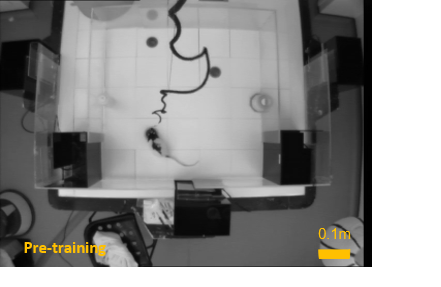

# **Testing the existence of 'reward cells' : Pipeline**

**INPUTS:**
Calcium Imaged 2D-video data collected from the CA1 region of awake, behaving rats across longitudinal training sessions 
                                                                AND 
                             Aerial video data captured above the arena during each training session 
                            
  Raw Calcium Data: 
  
  
   
       
       
  Aerial Video:
  
  
   
                             
                             

## **PRE-PROCESSING:**

- Calcium data is pre-processed using Inscopix, cell sets are identified via a NMF algorithm (CNMFe), Cell sets are longitudinally registred for each animal across sessions
- Cell traces are identified and thresholded creating a series of binary events 
- The output is cell_id's for each animal and the respective trace and events of each cell in each session

- DeepLabCut (Deep Neural Network for Pose Estimation) is trained on a set of frames from the aerial videos with the animals head identifed, DeepLabCut is then run on all videos    for each animal for pose estimation
- Secondary sorting is completed via a semi-automated algorithm flagging frame-to-frame transitions where the animal is moving at unrealistic speeds (via OpenCV)
- Coordinates are translated s.t. the bottom left corner of the arena is (0,0)
- The output is frame-by-frame series of (x,y) coordinates 

## **PLACE FIELD CENTRE IDENTIFICATION:** 

## **MUTUAL INFORMATION ESTIMATION:**

Estimators: Centralised Dirilecht Mixture, Kraskov, Plug-in 
MI(N,S) s.t. N:=Neuron events for a given neuron (as time-series), S:=(x,y) coordinates for a given session 

