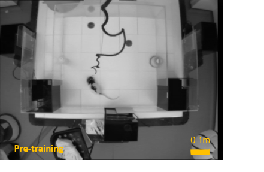

# rewardcells
Pipeline for testing the existence of 'reward cells' 

INPUTS: Calcium Imaged 2D-video data collected from the CA1 region of awake, behaving rats across longitudinal training sessions 
                                                                AND 
                             Aerial video data captured above the arena during each training session 
                            
  Raw Calcium Data: 
       
       
  Aerial Video:
       
                             
